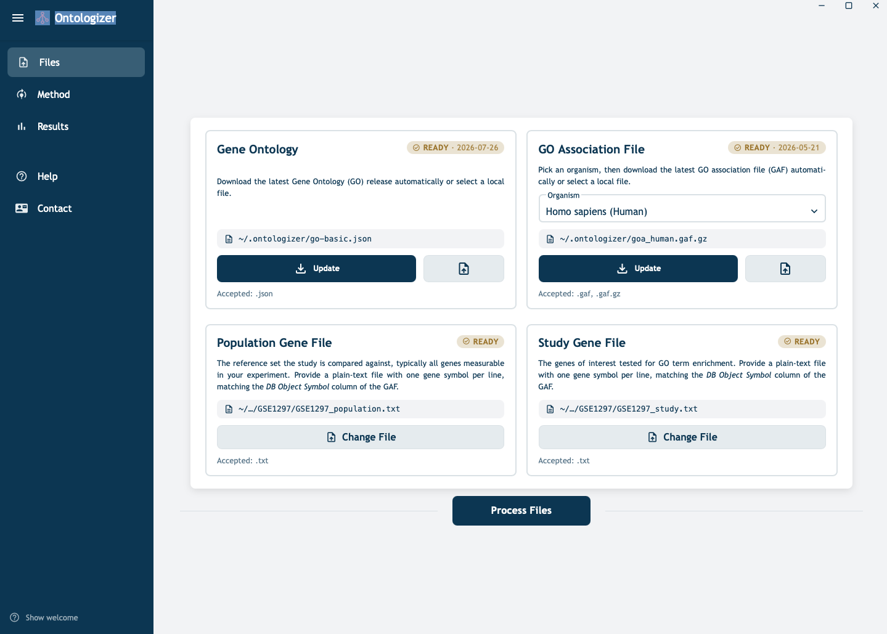
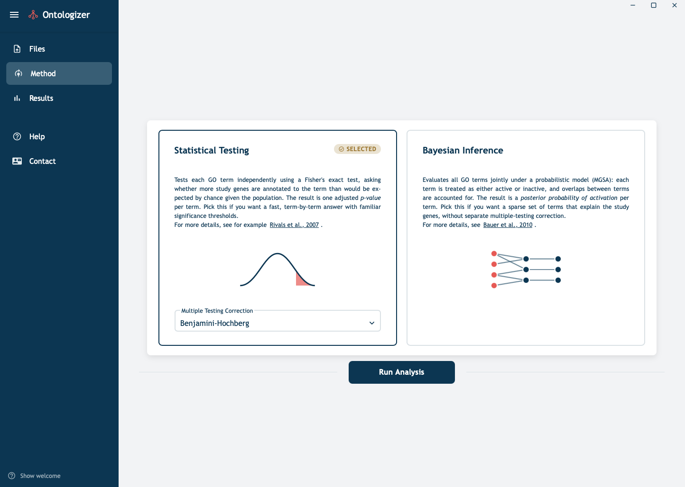
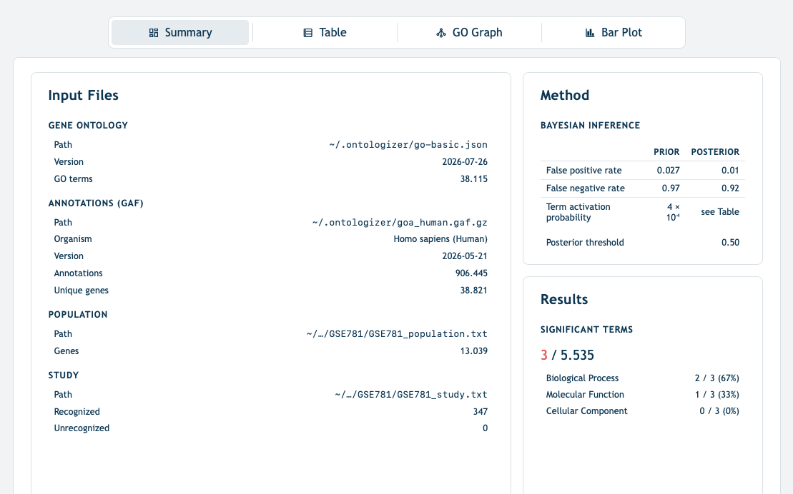
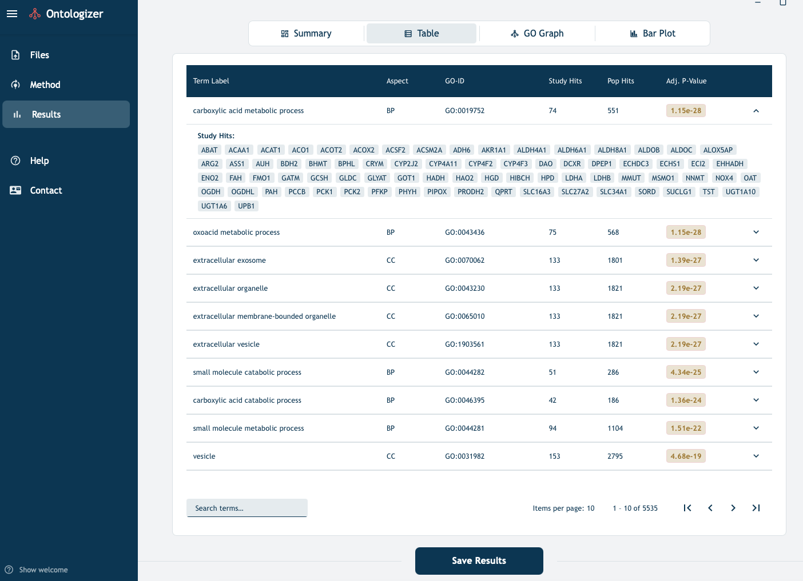
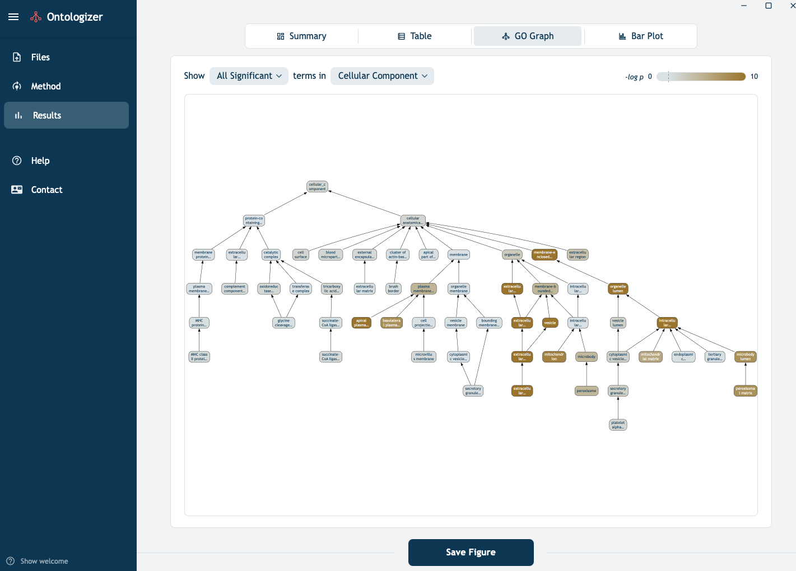
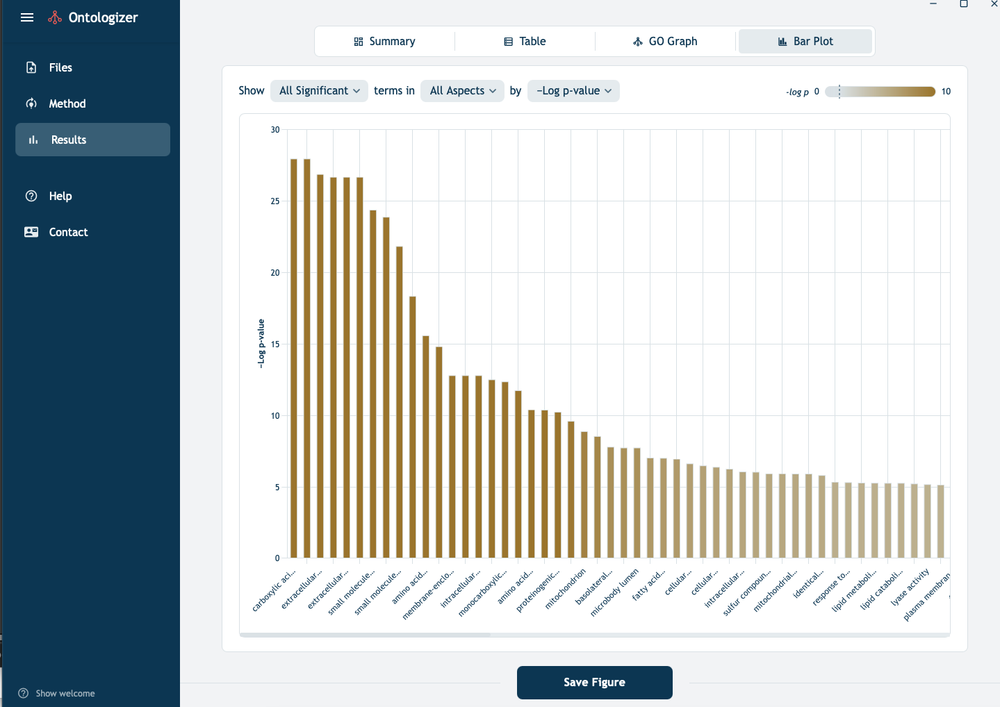

# Tutorial


## Downloading GO files

Users can have Ontologizer download both the ontology file (go-basic.json) and the GO annotation file for one of five species automatically to a local "ontologizer" folder or can link to the corresponding files that have been downloaded elsewhere on the user's system.

When the Ontologizer first starts, it creates a configuration directory in the user's home directory:

```bash
/User/username/.ontologizer
```

This directory contains a config file that stores the locations of the previously chosen input files (if any) as well as the downloaded GO and GOA files.

## Ontology files.

- **go-basic.json**

This is the "main" GO file that contains the GO terms and relations between the terms (is a, part of, regulates, negatively regulates and positively regulates). Relations are filtered so that the ontology is acyclic and is recommended for most GO-based annotation tools.

- **GO annotation (GOA) file**

The GO consortium maintains organism-specific annotation files that connect GO terms to gene (products) of species. For instance, the GOA file for humans is **goa_human.gaf**.

NOTE: In June 2026, the naming conventions for the GOA files will change. The Ontologizer will provide an updated automatic downloading facility soon after, but users can manually download any of the annotations files and link them locally.

## Gene files

Ontologizer requires experiment-specific **population gene file** and **study gene file** provided by the user. Both files list one gene symbol per line that must match the `DB_Object_Symbol` (column 3) of the GAF file for the same organism.
- **Population gene file**

The population set defines the background of genes against which enrichment is assessed. Typically, this comprises all the genes tested in the experiment. 
For an RNA-seq experiment, this is usually the set of genes that passed expression filtering before differential-expression analysis.
For a microarray experiment, it is the set of genes represented on the array.

Example (one gene symbol per line):

```text
A1BG
A2M
A4GALT
AAAS
AACS
...
```

- **Study gene file**

The study set is the subset of the population that is "of interest". In most cases the genes called significant by upstream analysis. 
The definition of *interest* depends on the experiment.

The study file uses the same format as the population file:

```text
BRCA1
TP53
MYC
RAD51
...
```


## Start-to-Finish Example

There are many ways of creating input files for the Ontologizer. In general, users will have a genomic dataset with a list of all genes to be measured (the population set) and one or more lists of study genes (e.g., differentially expressed genes or one study set for each cluster derived from the data). 

### 1. Differential Expression analysis

In this example, we will assume the user has performed differential expression analysis and has one study set. For users unfamiliar with how to perform DE analysis, we recommend the following articles

- [Rosati D, et al. (2024) Differential gene expression analysis pipelines and bioinformatic tools for the identification of specific biomarkers: A review. *Comput Struct Biotechnol J* **23**:1154-1168](https://pubmed.ncbi.nlm.nih.gov/38510977/)
- [Chung M, et al. (2021) Best practices on the differential expression analysis of multi-species RNA-seq. *Genome Biol* **2**:121](https://pubmed.ncbi.nlm.nih.gov/33926528/)

However differential expression analysis is performed, the results should be used to format a **population set file** and a **study set file** as explained above.

### 2. Install and start Ontologizer

See [installation](installation.md) for instructions on how to obtain and install Ontologizer. Start the tool as appropriate for your operating system (e.g., on a MacIntosh, use the Soptlight search to find and start the tool).

### 3. Load the files

- The top row of the files page of Ontology ([Figure 1](#fig-ontologizer-files)) allows users to obtain or update the `go-basic.json` and the species-specific annotation files, as explained above.
- The bottom row allows the user to load the `population set` and `study set` files.

<figure markdown="1" id="fig-ontologizer-files">
  { width="60%" }
  <figcaption>Figure 1: Ontologizer files and loading interface</figcaption>
</figure>


* For the example in this tutorial, we will use a study and population as described further below

- <a href="./assets/downloads/assets/GSE781_study.txt" download>GSE781 study set/a>
- <a href="./assets/downloads/assets/GSE781_population.txt" download>GSE781 population set/a>

### 4. Choose the method

- To navigate to the Method tab, choose `Method` in the menu on the left side ([Figure 2](#fig-ontologizer-method))
- Two analysis methods are available. Choose between them by clicking on the corresponding box
    1. Statistical Testing. This is the Term-for-Term Fisher Exact Test method. Three methods for multiple-testing correction are provided: Bonferroni (the default), Benajmini-Hochberg (shown in the Figure), Benjamini-Holm, and None (not recommended unless there is a specific motivation for not correcting for multiple testing).
    2. Bayesian Inference. This is the Model-Based Gene-Set (MGSA) approach. No parameters can be set for this method.
- Once you have chosen a method, press `Run Analysis` to start the corresponding analysis.

<figure markdown="1" id="fig-ontologizer-method">
  { width="60%" }
  <figcaption>Figure 2: Ontologizer methods</figcaption>
</figure>


### 5. Inspect the results

- When the analysis started in step 4 is finished (which should not take longer than a few seconds for the TfT approach, and might take up to a few minutes MGSA, depending on the size of the dataset), the `Results tab` is opened. In our example, we are showing an analysis of a dataset that is made available in the GSEABenchmarkeR R/Bioconductor package; The dataset is available at [NCBI GEO](https://www.ncbi.nlm.nih.gov/geo/query/acc.cgi?acc=GSE781) as GSE781, which described expression data from renal cell carcinoma (RCC) samples. 

- [Geistlinger L, et al. (2021) Toward a gold standard for benchmarking gene set enrichment analysis. *Brief Bioinform* **22**:545-556](https://pubmed.ncbi.nlm.nih.gov/32026945/) - described `GSEABenchmarkeR`
- [Lenburg ME, et al. (2003) Previously unidentified changes in renal cell carcinoma gene expression identified by parametric analysis of microarray data. *BMC Cancer* *3*:31](https://pubmed.ncbi.nlm.nih.gov/14641932/) - The RCC dataset


* **Summary page**
A summary page is provided with the file names, gene counts, GO term counts, and major results. In [Figure 3](#fig-ontologizer-summary">), the summary for a Bayesian analysis is shown; the page for statistical analysis is quite similar.

<figure markdown="1" id="fig-ontologizer-summary">
  { width="60%" }
  <figcaption>Figure 3: Ontologizer summary page</figcaption>
</figure>

**Tabular results**

The results table ([Figure 4](#fig-ontologizer-table)) shows
- **label**: The name or label of the GO term
- **aspect**  One of the three subontologies of GO: BP: *biological process*, CC (*cellular component*), or MF (*molecular function*)
- **GO ID**: The Term identifier of the GO term
- **Study hits**: The number of genes in the study set that are annotated to the GO term or any of its descendents (because of the true path rule, annotations to descendents are also valid for ancestor term)
_ **Pop. hits**: The number of genes in the population set that are annotated to the GO term or any of its descendents
- **Adj. P-Value**: The p-value for overrepresentation of the GO term in the study set, adjusted for multiple testing with the chosen mutiple-testing correction method.

<figure markdown="1" id="fig-ontologizer-table">
  { width="60%" }
  <figcaption>Figure 3: Ontologizer Results Page (Term-for-term)</figcaption>
</figure>

The results of analysis can be downloaded and the gene symbols representing the study hits can be shown by expanding the panel of the corresponding row.

**Graphical display**

The results of analysis can be visualized graphically ([Figure 5](#fig-ontologizer-graphical)). It is possible to limit the display to the top 20 or 25 terms if too many terms are significant. Hovering over individual terms reveals term-specific results. This view is intended to be used to explore the overrepresentation results in the context of the hierarchy of the Gene Ontology.

<figure markdown="1" id="fig-ontologizer-graphical">
  { width="60%" }
  <figcaption>Figure 3: Ontologizer Results Page (Term-for-term)</figcaption>
</figure>


**Bar plot**

The bar plot display shows all significant terms ranked according to p-value (the negative logarithm of the P-value is shown, so that the terms with the smallest, i.e., most significant, P-Values have the highest bars.) Results can also be displayed with respect to gene counts and enrichment ratio ([Figure 6](#fig-ontologizer-bar)).


<figure markdown="1" id="fig-ontologizer-bar">
  { width="60%" }
  <figcaption>Figure 3: Ontologizer Bar-Plot Page (Term-for-term)</figcaption>
</figure>


## TfT vs MGSA

The traditional, term-for-term Fisher-Exact Test approach tends to reveal many more terms that MGSA. In the above example,
TfT revealed 371 signficantly overrepresented GO terms, many of which were connected to each other in parent/child or ancestor/descendant relationships. 

A major purpose of GO analysis like this is the support hypothesis generation. So for instance, a scientist revieweing the above results might consider the hypothesis that renal cell carcinoma is related in some way to an abnormality related to the significant GO terms.

For example, if we search Google or PubMed for "renal cell carcinoma" and "carboxylic acid metabolism" because of the top hit, [carboxylic acid metabolic process](https://www.ebi.ac.uk/QuickGO/term/GO:0019752), we might find the following publication

- [Wang Y, et al. (2025) Comprehensive analysis of metabolic patterns in renal cell carcinoma: implications for prognosis and treatment. *Front Immunol* **16**:1630053](https://pubmed.ncbi.nlm.nih.gov/41041304/).

In this article, many different metabolic disturbances are discussed, including some that are related to *carboxylic acid metabolism*. 

It would be difficult to do a search like this for all 371 significant GO terms. A scientist could choose the most interesting ones on the basis of experience of intuition. The Model-Based Gene-Set (MGSA) method was designed to flag the "most important" GO terms [Bauer et al.]